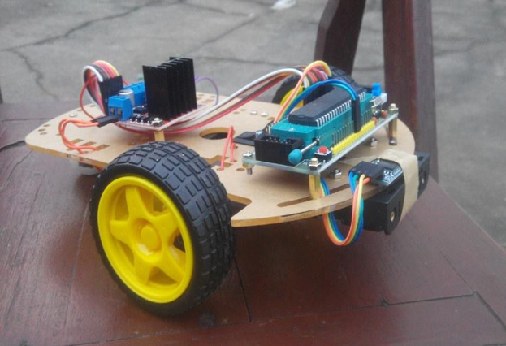

# Three-Wheeled Robot Control System

A team-built 8051-based robot that combines offline Chinese speech recognition, infrared obstacle avoidance, and wireless control. The controller drives the robot's motors and supports spoken movement and speed commands.

## Project Summary

- **Role:** Team Leader
- **Location and dates:** Yangzhou, China — March 2022 to July 2022
- **Reported results:** The team reported a 90% obstacle-avoidance success rate and voice response latency below 0.5 seconds. The original measurement procedure and test data are not included, so these figures have not been independently verified.

## Features

- 8051 firmware written in C for Keil C51 / µVision 4.
- Offline keyword recognition through an LD3320-based voice module.
- Infrared obstacle detection and motor control through an L298N driver.
- nRF24L01 wireless communication between the voice controller and robot chassis.
- Timer-interrupt PWM-style control of the two motor channels.

## Voice Commands

The firmware registers the following 11 pinyin keywords. Chinese characters and English meanings below are explanatory translations; the recognizer is configured with pinyin strings.

| Chinese | Pinyin keyword | English meaning | Firmware behavior |
|---|---|---|---|
| 小杰 | `xiao jie` | Wake word (“Xiaojie”) | Recognition keyword; no chassis action is mapped |
| 加速 | `jia su` | Speed up | Increase motor duty cycle |
| 减速 | `jian su` | Slow down | Decrease motor duty cycle |
| 前进 | `qian jin` | Move forward | Drive forward |
| 后退 | `hou tui` | Move backward | Reverse the motors |
| 左转 | `zuo zhuan` | Turn left | Differential turn left |
| 右转 | `you zhuan` | Turn right | Differential turn right |
| 停止 | `ting zhi` | Stop | Stop the motors |
| 你是谁 | `ni shi shui` | Who are you? | Sends an auxiliary response code |
| 唱首歌 | `chang shou ge` | Sing a song | Sends an auxiliary response code |
| 讲个故事 | `jiang ge gu shi` | Tell a story | Sends an auxiliary response code |

## Hardware

The supplied component list identifies an STC89C52-compatible 8051 controller, two DC geared motors, an L298N motor driver, an LD3320 voice-recognition module, two nRF24L01 radios, an infrared obstacle sensor, a chassis, and a battery pack. Check the board/module variants and wiring against the source and schematic before powering the hardware.

## Repository Contents

- `firmware/chassis/` — chassis controller source and Keil project.
- `firmware/voice/code/` — voice-controller C source and headers.
- `firmware/voice/user/` — serial support source and header.
- `firmware/voice/keil-project/` — voice-controller Keil project and nRF24L01 support files.
- `car.png` — photograph of the prototype robot.
- `README.md` — project overview, voice-command mapping, requirements, and references.

## Requirements

- Windows and Keil µVision 4 with the Keil C51 toolchain.
- Compatible 8051 target boards, LD3320-based speech module, nRF24L01 radios, infrared sensor, and L298N motor driver.
- The matching STC programmer and serial/USB adapter for flashing hardware.
- A compatible schematic editor to inspect the original schematic.

The project contains multiple Keil project snapshots and generated build artifacts. Their target settings may differ. Select the project that matches the actual board and review its device, clock, source-file list, and pin assignments before building or flashing. The source has not been rebuilt in this cleanup, and hardware behavior has not been retested.

## Build and Use

1. Install Keil µVision 4 and the C51 toolchain, plus the appropriate STC device support if required by the target.
2. Open `firmware/chassis/chassis_controller.uvproj` or `firmware/voice/keil-project/voice_controller.uvproj` in µVision.
3. Check the target device, oscillator frequency, include paths, source list, and pin mapping against the hardware.
4. Build the project in µVision and resolve any missing toolchain or project-path issues.
5. Flash the resulting firmware with a compatible programmer. Test with the wheels raised first, then test obstacle avoidance in a clear area.

The repository does not include vendor installers, driver installers, third-party papers, or module manuals. Obtain software and documentation from their respective rights holders or official sources.

## Technologies

Embedded C, 8051/STC89C52, Keil C51 / µVision 4, LD3320, nRF24L01, infrared sensing, L298N motor control.

## References

The following sources document the components used in the project and provide relevant background. The links point to publisher or manufacturer pages where available; source documents are cited here rather than copied into this repository.

### Component documentation

- STC Microelectronics, [STC89C52RC product documentation](https://www.stcmicro.com/STC/STC89C52RC.html).
- ICRoute, [LD3320 Development Manual](https://img.dfrobot.com.cn/wiki/none/fdd9e810f72b6947899e2d499993ae78.pdf) (manufacturer document hosted by DFRobot).
- Nordic Semiconductor, [nRF24L01 Product Specification, revision 2.0](https://devzone.nordicsemi.com/cfs-file/__key/support-attachments/beef5d1b77644c448dabff31668f3a47-aad1a46f307945a7b0204fd969e86bdf/content.pdf).
- STMicroelectronics, [L298 Dual Full-Bridge Driver Datasheet](https://www.st.com/resource/en/datasheet/l298.pdf).

### Related reading

- Zhang, Ji, and Teng-fei Yang. [“Design of Vehicular Speech Recognition System.”](https://cnki.istiz.org.cn/kcms/detail/detail.aspx?dbcode=CJFD&dbname=CJFD2011&filename=JMDB201102010) *Journal of Jiamusi University (Natural Science Edition)*, 2011, issue 2. (Chinese title: “车载自动语音识别系统设计.”)
- Hong, Jiapeng. [“Application of Embedded Speech Recognition System with LD3320.”](https://m.chinaaet.com/article/171692) AET, February 23, 2012. (Chinese title: “LD3320的嵌入式语音识别系统的应用.”)
- Su, Baolin. [“Speech Recognition System Design Based on AVR MCU.”](https://www.eepw.com.cn/article/218550.htm) *Modern Electronics Technique* 35, no. 11 (2012): 136–138. (Chinese title: “基于AVR单片机的语音识别系统设计.”)

## Course and Team Context

This was a university team project completed in Yangzhou from March to July 2022. The project summary identifies the contributor as team leader; implementation was collaborative, and this repository does not establish individual authorship for every source file.

## Included and Excluded Materials

The repository contains the project firmware, Keil project files, this documentation, and a prototype photo. The original directory also contains third-party papers, chip/module manuals, software and driver installers, videos, build outputs, and an Altium download link; these are not included.

## GitHub Repository Recommendation

- **Name:** `three-wheeled-robot-control`
- **Description:** `8051-based three-wheeled robot with offline Chinese voice control, infrared obstacle avoidance, and nRF24L01 communication.`
- **Topics:** `embedded-systems`, `8051`, `robotics`, `embedded-c`, `speech-recognition`, `obstacle-avoidance`
- **Portfolio assessment:** Useful supporting project demonstrating embedded integration and team leadership. The reported performance figures are not independently verified.
